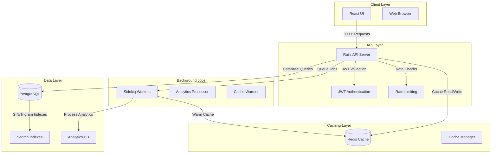

# Smart Search System Architecture

## System Overview
Full-stack search system with React frontend, Rails API backend, PostgreSQL database, and Redis caching.

## Architecture Diagram



## Component Details

### 1. Frontend (React + Tailwind CSS)
- **Search Component**: Debounced input with 300ms delay
- **Suggestions Component**: Dropdown with cached results
- **Results Component**: Paginated product listings
- **Filters Component**: Category, price range, tags
- **State Management**: React Context + Custom Hooks

### 2. Backend (Rails 8.1 API)
- **Controllers**:
  - `SearchController` - Main search endpoint
  - `SuggestionsController` - Autocomplete suggestions
  - `AnalyticsController` - Search metrics
- **Models**:
  - `Product` - Searchable content
  - `SearchQuery` - Query analytics
  - `UserSearchHistory` - Personalization
- **Services**:
  - `SearchService` - Core search logic
  - `RankingService` - Relevance scoring
  - `CacheService` - Redis interactions

### 3. Database Schema (PostgreSQL)
```sql
-- Products table (main searchable content)
CREATE TABLE products (
    id BIGSERIAL PRIMARY KEY,
    title VARCHAR(255) NOT NULL,
    description TEXT,
    category_id INTEGER,
    price DECIMAL(10,2),
    popularity_score INTEGER DEFAULT 0,
    created_at TIMESTAMP,
    updated_at TIMESTAMP
);

-- Search indexes
CREATE INDEX idx_products_title_trgm ON products USING gin(title gin_trgm_ops);
CREATE INDEX idx_products_description_trgm ON products USING gin(description gin_trgm_ops);
CREATE INDEX idx_products_category ON products(category_id);
CREATE INDEX idx_products_popularity ON products(popularity_score DESC);

-- Search analytics
CREATE TABLE search_queries (
    id BIGSERIAL PRIMARY KEY,
    query TEXT NOT NULL,
    user_id INTEGER,
    results_count INTEGER,
    created_at TIMESTAMP
);
```

### 4. Caching Strategy (Redis)
- **Suggestions Cache**: `suggestions:{query_prefix}` - TTL: 5 minutes
- **Popular Queries**: `popular:queries` - Sorted set with scores
- **User History**: `user:{id}:recent_searches` - List, max 10 items
- **Result Cache**: `search:{query_hash}:{page}` - TTL: 2 minutes

### 5. API Contract Specifications

#### Search Endpoint
**GET /api/search**
```
GET /api/search?q=iphone+13&page=1&category=electronics&min_price=500&max_price=1000&sort=relevance
```

**Query Parameters:**
- `q` (string): Search query (required)
- `page` (integer): Page number, default: 1
- `per_page` (integer): Results per page, default: 20
- `category` (string): Filter by category
- `min_price`, `max_price` (number): Price range filter
- `tags` (string): Comma-separated tags
- `sort` (string): `relevance`, `price_asc`, `price_desc`, `popularity`, `newest`

**Headers:**
- `Authorization: Bearer <jwt_token>` (optional for personalized results)

**Response (200):**
```json
{
  "results": [
    {
      "id": 123,
      "title": "iPhone 13 Pro Max",
      "description": "Latest Apple smartphone with A15 Bionic",
      "category": "electronics",
      "price": 999.99,
      "image_url": "https://example.com/iphone.jpg",
      "popularity_score": 85,
      "match_score": 0.92,
      "highlighted_title": "<mark>iPhone</mark> 13 Pro Max",
      "highlighted_description": "Latest Apple <mark>iPhone</mark> with A15 Bionic"
    }
  ],
  "pagination": {
    "page": 1,
    "per_page": 20,
    "total_pages": 5,
    "total_results": 95
  },
  "suggestions": [
    "iphone 13 case",
    "iphone 13 pro",
    "iphone 13 charger"
  ],
  "filters_available": {
    "categories": ["electronics", "phones", "accessories"],
    "price_ranges": ["0-100", "100-500", "500-1000", "1000+"],
    "tags": ["apple", "5g", "256gb"]
  }
}
```

**Error Responses:**
- `400 Bad Request`: Invalid parameters
- `401 Unauthorized`: Invalid/missing JWT for personalized features
- `429 Too Many Requests`: Rate limit exceeded
- `500 Internal Server Error`: Server error

#### Suggestions Endpoint
**GET /api/suggestions**
```
GET /api/suggestions?q=iph&limit=5
```

**Query Parameters:**
- `q` (string): Partial query (required)
- `limit` (integer): Max suggestions, default: 5

**Response (200):**
```json
{
  "suggestions": [
    {"text": "iphone", "type": "popular", "count": 1250},
    {"text": "iphone 13", "type": "recent", "count": 320},
    {"text": "iphone case", "type": "related", "count": 890}
  ],
  "cached": true,
  "response_time_ms": 45
}
```

#### Analytics Endpoint
**POST /api/analytics/click**
```
POST /api/analytics/click
Authorization: Bearer <jwt_token>
Content-Type: application/json

{
  "query_id": "abc123",
  "result_id": 123,
  "position": 1,
  "session_id": "session_xyz"
}
```

#### Trending Searches
**GET /api/trending**
```
GET /api/trending?timeframe=day&limit=10
```

**Response (200):**
```json
{
  "trending": [
    {"query": "iphone 15", "count": 1250, "change": "+15%"},
    {"query": "laptop", "count": 890, "change": "-5%"}
  ],
  "timeframe": "day",
  "generated_at": "2024-01-15T12:00:00Z"
}
```

### 6. Performance Optimizations
- PostgreSQL GIN indexes for trigram search
- Redis caching layer for frequent queries
- Connection pooling for database
- Background job processing for analytics
- CDN for static assets

### 7. Security Measures
- JWT authentication for personalized features
- Rate limiting via Rack::Attack
- SQL injection prevention with ActiveRecord
- Input sanitization and validation
- CORS configuration for frontend

## Deployment Architecture
- **Frontend**: Vercel/Netlify (static hosting)
- **Backend**: Heroku/Railway (PaaS) or AWS ECS
- **Database**: AWS RDS PostgreSQL
- **Cache**: Redis Cloud or ElastiCache
- **Monitoring**: New Relic/Sentry for APM

## Scalability Considerations
- Horizontal scaling of Rails API instances
- Read replicas for PostgreSQL
- Redis cluster for distributed caching
- CDN for global asset delivery
- Load balancing with Nginx/HAProxy